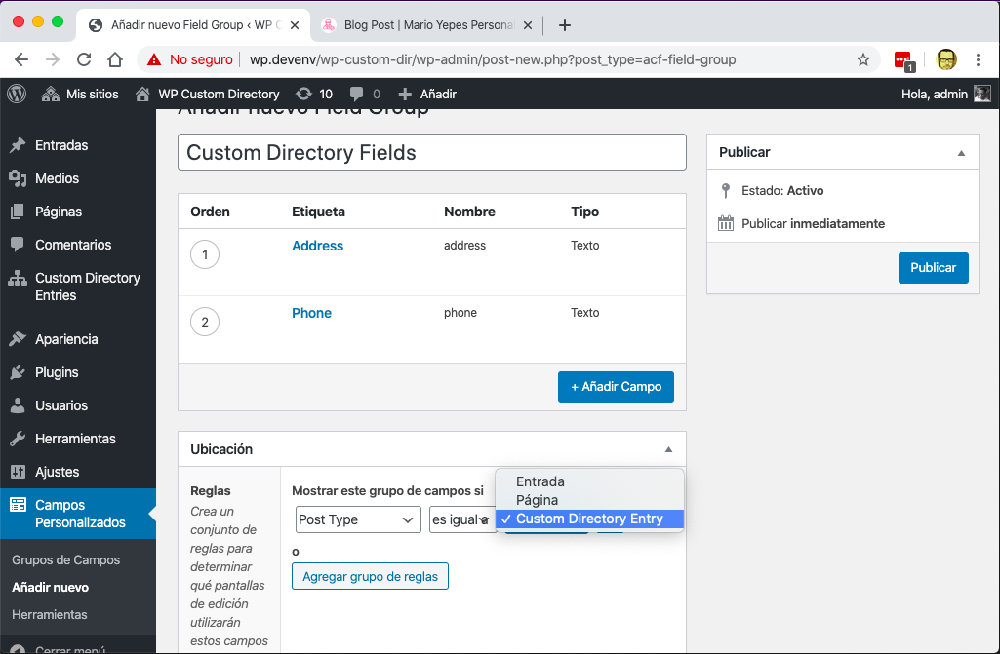

# Wordpress Custom Directory Help

The **Wordpress Custom Directory** plugin, allows you to create a searchable list of items in any page or any blog post. Additionally, each item will have its own page with its own url.

Items in the list can be Personnel Profiles, Product Information (although Woocumerce would be better for that use case), Catalog Information, etc.

The main features of the plugin are:

- Allows you to create a list of items that can be embedded in any page or post
- You can add a custom form on top of the list of items so you can filter the items
- You use a template to modify how how the **list items** are displayed and what information will be included in the list.
- Every _directory item_ has its own URL which make it SEO friendly
- You also use a template to modify how the **individual items** are displayed
- Both templates use the [Twig](https://twig.symfony.com/doc/3.x/) template language to specify what to include in the items or in the list. (If you've used Shopify's Liquid system, you'll be right at home here)
- You specify how the search on the _list items_ will work or by which fields the search will be made
- The _directory items_ are WordPress post types, so you can use plugins like [ACF](https://www.advancedcustomfields.com/) to add fields to the items. Or use WordPress filters to modify what information will be in every item.
- You can select the base path for the _directory items_
- You can create more than one directory by using taxonomies

Since you have to create templates on how items are going to be displayed **you need to have some basic understanding of html**.

## Installation and Setup

The process of creating a new directory involves the following steps:

- Install the plugin
- (optionally) create custom fields
- Configure the plugin (select base path, create the templates, etc.)
- Create an actual Directory (a taxonomy)
- Add items to the directory
- Create a page for displaying a list of items and the search

For the following steps, we're going to assume that we are going to create a directory of _Doctor Profiles_ where we'll have a field for the `biography`, another field for the `phone` and a field for the `address`.

### 1. Install the plugin

First of all, you have to install the **WordPress Custom Directory** (and if you are reading this documentation is very likely that you already did) using the WordPress plugin directory o uploading it to your server.

Then you have to activate the plugin.

> Its recommended that you also activate the ACF plugin if you already have it.

### 2. (Optional) Create some custom fields

If you activated the ACF plugin, this is the time to create a new group of fields.

Make sure that the **visible on post type** option includes `Custom Directory Entry`

As you can see from the image, we created two fields:

- One for the `phone`
- One for the work `address`

We'll be using the native `content` field for the _biography_ (more on the content field latter).

### 3. Configure the plugin

Go to the plugin's settings page and start the configuration.

### 4. Choose an slug or base path for the directory items

Every directory entry will have the same _base path_. By default it is `directory-entry`.

So if you create an item with the name `Jhon Doe Profile` its very possible that the URL for that item will be `https://my-site-domain.com/directory-entry/jhon-doe-profile`.

With this option, you can change the part that says `directory-entry`

> The `jhon-doe-profile` part can be changed directly in the _item edit page_

For you example we'll be using `staff`.

### 5. (optional) Change the sidebar link **name**

If you are configuring this plugin for a client, its possible that the name `Custom Directory Entries`, which is the default name that will appear in the admin sidebar, wont mean much to them.

With this setting, you can change that name for something more familiar to your client.

In our example we'll use `Staff Information`.

### 6. Remove the title of the single item page ?

**This only works if you are using the genesis framework**

This option will allow to remove the default title the _single item_ entry so you can place it somewhere else (like to the side or in a Gutemberg block)

### 7. Change the single item page layout

**This only works if you are using the genesis framework**

Similar to the previous option, you can opt to remove the sidebar on the _single item_ pages.

### 8. Templates

One of the strengths of the _Wordpress Custom Directory_ plugin is the ability to change how the directory items will be displayed on a list and individually.

You achieve this flexibility by using html templates with some special codes that once parsed will show the information you specify exactly where and how you need it.

You have to specify 3 templates:

- A template for the _single item_. So you can add or remove custom fields or change completely how an _entry item_ will look.
- A template for each _item_ when they get displayed on a list by using the `[custom-directory-list]` shortcode.
- The code for the search form that will be created by the `[custom-directory-search]` shortcode

Both the _Single element template_ and the _List element template_ use the [Twig](https://twig.symfony.com/doc/3.x/) template system. so if you want to change a field to be uppercase, you could use something like `{{title|uppercase}}`.

The search template does not uses Twig and there is no possibility to use variables.

#### Single element template

This will allow you to change how an individual item of the directory is displayed.

So in our example we might have an entry with the following data:

- `Name`: John Doe
- `Bio`: Our chief doctor
- `phone`: 301432456
- `address`: Leak Road, Miami

We could create a template like this:

	<h1>
		{{title}}
	</h1>

	

		

			{{address}}
		

		

			{{phone}}
		

	

	{{content}}

You can see that we use the native `title` field for the name and the native field `content` for the biography.

So when you go to the URL `https://mi-site-url.com/staff/john-doe` you'll get something like this:

#### List element template

In the same fashion as the _Single element template_ you can specify which fields of each item will appear in the directory.

Just take into account that while the _Single element template_ should be designed for displaying the complete information of an item in a page by itself. The _List element template_ should be designed for displaying **all** the elements of the directory on a list.

For our example, we'll use the following template.

	

		

			
		

		

			<h3>
				{{title}}
			</h3>
			{{excerpt}}
			

				<a class="btn btn-primary" href="{{link}}">Read more</a>
			

		

	

Which in the front-end will look like this.

#### Search form code

The main idea behind the _Wordpress Custom Directory_ is to have a way to display a list or directory of items on a page and that **it can be searchable** in a easily manner.

But since the plugin doesn't know by which fields the user is going to search, it's our job to specify them.

So in this section you have to add the HTML corresponding to an HTML for where **the form fields names match the items fields names**.

Also important to keep in mind: The fields that you use for the search **have to be included in the fields you display in the list**

For our example we are showing only 2 fields: The `title` and the `excerpt`. So our search should be something like:

## Content of your directory

The setup (previous step) allows you to configure how the items of your directory will be displayed on a list or in a single page. But you still need **add the content for you directory**.

This is a 2 step process:

1. Create at least one directory
2. Create the entries or items for this directory

### 1. Create a directory

To display your directory or list of items, go to `Custom Directory Entries > Directories` and create a new directory.

> Remember that this label can be changed in the settings page. So read this documentation accordingly.

You just need to give it a name. But **is very important that you take note of the directory slug** since well need that when we start using the shortcodes.

### 2. Create Entries

Go to `Custom Directory Entries > Custom Directory Entries` and start adding entries to your directory.

**Remember to add each entry to the just created Directory** by selecting the correct checkbox on the _right_ sidebar in the editor page.

## Create a directory page

This is where all is put together!.

Got to `Pages > Add New` and create a normal page.

In this page you need to place 2 shortcodes:

1. The Search Shortcode
2. The List or Items Shortcode.

This could be something like:

	
lorem ipsum dolor ... 

	<h2>Search the directory</h2>
	[custom-directory-search slug="dir-slug"]

	[custom-directory-list slug="dir-slug"]

Here is very important that

1. The directory slug (`dir-slug`) is the one that you copied in the _Directory Creation_ step
2. The slug is the same in both cases

The first shortcode will place the form you configured in Settings and the second shortcode will place the _list of items_ for the selected directory

You should notice that the **search form** have the fields that you configured in the settings page and that the **list of items** have the fields you specified in the settings page but with the correct values for each _item_.

## Using the directory

Just start typing in one of the search fields in the directory and confirm that the items that do not match are hidden.

## Shortcode parameters

The plugin provides 3 shortcodes:

1. `[custom-directory-search]`
2. `[custom-directory-list]`
3. `[custom-directory-item]`

Each shortcode has its own set of parameters, but they all share in common that you can **override the template by adding content** to the shortcode.

For example:

	[custom-directory-list directory="doctors"]
	

		Title: {{title}}  
		Names: {{first_name}} {{last_name}}, {{credentials}}
	

	[/custom-directory-list]

### The `custom-directory-search` shortcode

This shortocode places a search form in a page that allows you to do a live search.

**This shortocode does not places the list of items**

The content of this search form is configured in the _Settings_ page on the section that says `Search form code`

#### Parammeters

This shortcode receives 2 parameters:

1. `id` to select the HTML ID attribute of the form
2. `directory` to select on which directory make the search. This is specially important when you want to place multiple directories in a single page.

### The `custom-directory-list` shortcode

This plugin places a list of items on a page.

How each item of the list will be displayed can be configured in the settings page by adding content to the `List element template`

#### Parammeters

1. `directory` Allows you to select which directory to display.
2. `order` Allows you to select by which fields the elements of the list will be ordered. Pe:
	- `[custom-directory-list order="last_name"]`: Order by last name ascending
	- `[custom-directory-list order="title ASC, first_name DESC"]`: Order by title ascending and then by first_name descending
3. `filter_key` and `filter_val` Allows you to _Filter Out_ elements of the list. Pe.
	- `[custom-directory-list filter_key="last_name" filter_val="Yepes"]`: Only show records with last name equal to "Yepes"
	- `[custom-directory-list filter_key="credentials" filter_val="MD.+"]`: Only show records where the credentials field STARTS with `MD`. NOTICE that the `filter_value` is a **regular expression**.
4. `id` allows you to select the HTML ID attribute of the list.
5. `class` allows you to select the HTML CLASS attribute of the list.

### The  `custom-directory-item` shortcode

Allows you to place a directory item in **any** page.

This shortcode is useful when you need to embed the content of an item on several places

	[custom-directory-item slug="john-doe-doctor"]

#### Parammeters
This shortocode only requires either `slug` or `item` where:

- `slug` is the slug created by WordPress (or modified by you ) when you create the item
- `item` is the item number ID of the post provided by WordPress.

One very special thing about this shortcode is that if you do not provide any of those 2 parameters, the shortcode will try to recover them from the URL of the current page.

So if you visit a page with this shortcode on the URL `https://my-blog.com/2020/02/my-blog-entry?slug=john-doe-doctor` then the shortcode will show the information of the item with slug `johon-doe-doctor`.

## Creating templates

The templates uses the [Twig engine](https://twig.symfony.com/) which is very similar to [Liquid](https://shopify.github.io/liquid/) but in several ways more powerful.

Please refer to the Twig documentation on how to use it.

But the gist of it all is that any code enclosed in `{{` and `}}` will be assumed to be a variable and it will be replaced at runtime.

