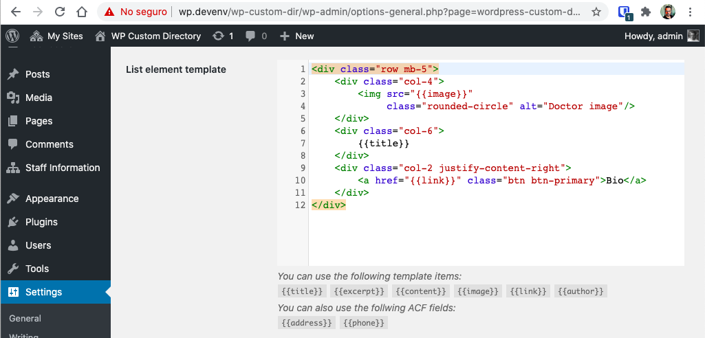

# Wordpress Custom Directory Help

The **Wordpress Custom Directory** plugin, allows you to create a searchable list of items in any page or any blog post. Additionally, each item will have its own page with its own url.

Items in the list can be personnel profiles, product information (although WooCommerce would be better for that use case), catalog information, definitions of specialized terms, etc.

_A list of doctors profiles_

The main features of the plugin are:

- Allows you to create a list of items that can be embedded in any page or post
- Every _directory item_ has its own page with its own URL which make it SEO friendly
- You can add a custom form on top of the list of items so you can _live filter_ the items
- You use a template to modify how how the **list items** are displayed and what information will be included in the list (The template is configured righ in the WordPress Settings)
- You also use a template to modify how the **individual items** are displayed (The template is configured righ in the WordPress Settings)
- Both templates use the [Twig](https://twig.symfony.com/doc/3.x/) template language to specify what to include in the items or in the list. (If you've used Shopify's Liquid system, you'll be right at home here)
- You specify how the search on the _list items_ will work or by which fields the search will be made
- The _directory items_ are WordPress posts, so you can use plugins like [ACF](https://www.advancedcustomfields.com/) to add fields to the items. Or use WordPress filters to modify what information will be in every item.
- You can select the base path for the _directory items_
- You can create more than one directory by using taxonomies

Since you have to create templates on how items are going to be displayed **you need to have some basic understanding of html**.

## Installation and Setup

The process of creating a new directory involves the following steps:

- Install the plugin
- (optionally) create custom fields with a plugin like ACF
- Configure the plugin (select base path, create the templates, etc.)
- Create an actual Directory (a taxonomy)
- Add items to the directory
- Create a page for displaying a list of items and the search

For the following steps, we're going to assume that we are going to create a directory of _Doctor Profiles_ where we'll have a field for the `biography`, another field for the `phone` and a field for the `address`.

### 1. Install the plugin

First of all, you have to install the **WordPress Custom Directory** (and if you are reading this documentation is very likely that you already did) using the WordPress plugin directory o uploading it to your server.

Then you have to activate the plugin.

> Its recommended that you also activate the ACF plugin if you already have it.

### 2. (Optional) Create some custom fields

If you activated the ACF plugin, this is the time to create a new group of fields.

Make sure that the **visible on post type** option includes `Custom Directory Entry`

As you can see from the image, we created two fields:

- One for the work address called _Address_ and with the name `address`
- One for the telephone called _Phone_ and with the name `phone`

> The names are important.

We'll be using the native `content` field for the _biography_ (more on the content field latter).

### 3. Configure the plugin

Go to the plugin's settings page and start the configuration.

### 4. (optional) Choose an slug or base path for the directory items

Every directory entry will have the same _base path_. By the image above, you can see that the default _base path_ is is `directory-entry`.

So if you create an item with the name `Jhon Doe Profile` its very possible that the URL for that item will be `https://my-site-domain.com/directory-entry/jhon-doe-profile`.

With this option, you can change the part that says `directory-entry`

> The `jhon-doe-profile` part can be changed directly in the _item edit page_

For our example we'll be using `staff`.

### 5. (optional) Change the sidebar link **name**

If you are configuring this plugin for a client, its possible that the name `Custom Directory Entries`, which is the default name that will appear in the admin sidebar, wont mean much to them.

With this setting, you can change that name for something more familiar to your client.

In our example we'll use `Staff Information`.

### 6. (optional) Remove the title of the single item page ?

**This only works if you are using the genesis framework**

This option will allow to remove the default title the _single item_ entry so you can place it somewhere else (like to the side or in a Gutemberg block).

> If you are using another type of template system, this setting wont have any effect.

### 7. (optional) Change the single item page layout

**This only works if you are using the genesis framework**

Similar to the previous option, you can opt to remove the sidebar on the _single item_ pages.

> If you are using another type of template system, this setting wont have any effect.

### 8. Create templates

You have to create at least 2 templates to work:

- The _single element_ template
- The _list_ templates 

> This is not optional and deserves its own help section below.

If you are going to use live search on your list, you sould also create a 3rd template to specify how to search the elements.

## Create the Directory and its items

The setup (previous section) allows you to configure how the items of your directory will be displayed on a list or in a single page. But you still need **add the content for you directory**.

This is a 2 step process:

1. Create at least one directory
2. Create the entries or items for this directory

### 1. Create a directory

To display your directory or list of items, go to `Custom Directory Entries > Directories` and create a new directory.

> Remember that this label can be changed in the settings page. So read this documentation accordingly.

You just need to give it a name. But **is very important that you take note of the directory slug** since well need that when we start using the shortcodes.

In this example we just created one directory called **Staff** and it will have the slug **staff**

### 2. Create Entries

Go to `Custom Directory Entries > Custom Directory Entries` and start adding entries to your directory.

The important thing to keep in mind is that an **item** is assigned to a **directory** by checking or selecting  selecting the **correct checkbox on the _right_ sidebar in the editor page**. And that an **item** can belong to **multiple directories**.

### 3. Create a directory page

** This is where all is put together!.**

Got to `Pages > Add New` and create a regular page.

In this page you need to place at least the shortcode `[custom-directory-list]` with the parammeter `directory`.

> We'll talk more about the shortcodes in an section below.

	
This is our Staff

	<h2>Search the directory</h2>

	[custom-directory-list directory="staff"]

Here is very important to point out that the `directory` attribute points to the **slug** of the directory we just created.

This would render something like:

> You might not get the same result since we haven't looked at how to create the templates. That will be discussed in the next section

## Templates

One of the strengths of the _WordPress Custom Directory_ plugin is the ability to change how the directory items will be displayed on a list and individually.

You achieve this flexibility by using html templates with some special codes that once parsed will show the information you specify exactly where and how you need it.

You have to specify 3 templates:

- A template for the _single item_. So you can add or remove custom fields or change completely how an _entry item_ will look.
- A template for each _item_ when they get displayed on a list by using the `[custom-directory-list]` shortcode.
- The code for the search form that will be created by the `[custom-directory-search]` shortcode

The **List** and **Single item** templates uses the [Twig engine](https://twig.symfony.com/) which is very similar to [Liquid](https://shopify.github.io/liquid/) but in several ways more powerful.

The gist of it all is that any code enclosed in `{{` and `}}` will be assumed to be a variable and it will be replaced at runtime. Also, you can use filters for each item by using the `|` character.

So if you want to change a field to be uppercase, you could use the `uppercase` filter like this:

    {{title|uppercase}}

Please read the Twig documentation of how to use blocks, conditionals and filters.

- **Note 1:** The search template does not use Twig and its not possible to use variables.

- **Note 2:** Currently its not possible to create different templates for different directories.

### 1. Single element template

This will allow you to change how an _individual item page_ will be displayed.

So in our example we might have an entry with the following data:

- `title`: John Doe Title
- `content`: This is the BIO of John Doe
- `phone`: 301432456
- `address`: 4321 New York Road, FL

> The last 2 are the ACF fields we created at the start of this tutorial

We could create a template like this:

	

		

			<h1>
				{{title}}
			</h1>
		

		

			
		

	

	

		

			Address: {{address}}
		

		

			Phone: {{phone}}
		

	

	

		

			{{content}}
		
	
	

> For this tutorial I'm using a Bootstrap based theme. That's why I can use the `col-8` and `row` classes for `
` elements.

You can see that we use the native `{{title}}` field for the name and the native field `{{content}}` for the biography. Also, I'm using `{{image}}` to embed the _Featured Image_ URL.

> The list of available fields is at the bottom of the textarea.

Now, If I create a _Directory Item_ with the following content

Then we could visit the URL `https://mi-site-url.com/staff/john-doe-title` and get something like this:

Things to notice:

- The `{{image}}` came from the _Featured Image_
- The `{{title}}` is the post title
- The biography came from the post `{{content}}` 
- `phone` and `address` are the custom fields added at the beginning of this tutorial
- The URL is created by WordPress from the title, but you can change it like any other page or post
- After the field for _Single Item Template_ There is **a list of available fields** that you can use

### 2. List element template

In the same fashion as the _Single element template_ you can specify which fields of each item will appear in the directory list.

Just take into account that while the _Single element template_ should be designed for displaying the complete information of an item in a page by itself. The _List element template_ should be designed for displaying **all** the elements of the directory on a list.

For our example, we'll use the following template.

	

		

			
		

		

			{{title}}
		

		

			<a href="{{link}}" class="btn btn-primary">Bio</a>
		

	

Which in the front-end will look like this.

> We already saw this in the _Directory Creation_ section

## Adding Search

The main idea behind the _Wordpress Custom Directory_ is to have a way to display a list or directory of items on a page and that **it can be searchable** in a simple manner.

But since the plugin doesn't know by which fields the user is going to search, it's our job to specify those fields.

So in this section you have to add the code corresponding to an HTML form where **the form fields names match the items fields names**. 

So, in our example we have _Custom Field_ called `phone` and another one called `address`. This means that we could add a field in the form with the **name** of `phone` and another with the **name** `address` and the options be a list of possible addresses:

	<input name="phone" type="text" placeholder="123456">
	<select name="address">
		<option value="4321 New York Rad, NY">New York</option>
		<option value="1234 Washington Av, WA">Washington</option>
	</select>

Also important to keep in mind: 

- The fields that you use for the search **have to be included in the fields you display in the list**
- You should **not** provider the opening and closing tag for the form: `<form>` and `</form>`
- You can use any input field type, but the better supported are `<input>` and `<select>`
- The search uses regular expresions

### 1. Creating the search form

At the end of the Settings Page, you have to provide the HTML required to display a search form.

For this example we are showing only 2 fields: The `title` and the `address`.

	

		

			<label for="title">Names</label>
			<input type="text" name="title" placeholder="Names" class="form-control"/>		
		

		

			<label for="address">Address</label>
			<select name="address" class="form-control">
				<option></option>
				<option value="1234 Miami Road, FL">1234 Miami Road, FL</option>
				<option value="4321 New York Road, NY">4321 New York Road, NY</option>
			</select>
		

	

> In this example, the select input won't work since that field WAS NOT included in the **List Template**

### 2. Adding the shortcut to the directory page

Then we have to include that search form in the **page where we already added the `[custom-directory-list]` shortcode**.

So just add the `[custom-directory-search]` shortcode with the **same directory attribute**. In our case `staff`:

	
This is our Staff

	<h2>Search the directory</h2>

	[custom-directory-search directory="staff"]

	[custom-directory-list directory="staff"]

And you'll get something like this:

## 3. Using the directory

Just start typing in one of the search fields in the directory and confirm that the items that do not match are hidden.

## Shortcodes

The plugin provides 3 shortcodes:

1. `[custom-directory-search]`
2. `[custom-directory-list]`
3. `[custom-directory-item]`

Each shortcode has its own set of parameters, but they all share in common that you can **override the template by adding content to the shortcode**.

For example:

    [custom-directory-list directory="staff"]
    

    	Title: {{title}}  
    	Names: {{first_name}} {{last_name}}, {{credentials}}
    

    [/custom-directory-list]

This is specially useful if you are using multiple directories since you can only specify one set off templates on the Settings page.

### The `custom-directory-search` shortcode

This shortocode places a search form in a page that allows you to do a live search.

> This shortocode does not places the list of items

The content of this search form is configured in the _Settings_ page on the section that says `Search form code` or by passing content to the shortcode as explained a second ago.

#### Parammeters

This shortcode receives 2 parameters:

1. `id` to select the HTML ID attribute of the form
2. `directory` to select on which directory make the search. This is specially important when you want to place multiple directories in a single page.

### The `custom-directory-list` shortcode

This plugin places a list of items on a page.

How each item of the list will be displayed can be configured in the settings page by adding content to the `List element template` or by passing content to the shortcode as explained a second ago.

#### Parammeters

1. `directory` Allows you to select which directory to display.
2. `order` Allows you to select by which fields the elements of the list will be ordered. Pe:
   - `[custom-directory-list order="last_name"]`: Order by last name ascending
   - `[custom-directory-list order="title ASC, first_name DESC"]`: Order by title ascending and then by first_name descending
   - By default it orders by `menu_order ASC` and then by `date DESC`.
3. `filter_key` and `filter_val` Allows you to _Filter Out_ elements of the list. Useful to show a limited set or records on multiple pages. Pe:
   - `[custom-directory-list filter_key="last_name" filter_val="Yepes"]`: Only show records with last name equal to "Yepes"
   - `[custom-directory-list filter_key="credentials" filter_val="MD.+"]`: Only show records where the credentials field STARTS with `MD`. NOTICE that the `filter_value` is a **regular expression**.
4. `id` allows you to select the HTML ID attribute of the list.
5. `class` allows you to select the HTML CLASS attribute of the list.

### The `custom-directory-item` shortcode

Allows you to place a directory item in **any** page.

This shortcode is useful when you need to embed the content of an item on several places

    [custom-directory-item slug="john-doe-doctor"]

#### Parammeters

This shortocode only requires either `slug` or `item` where:

- `slug` is the slug created by WordPress (or modified by you ) when you create the item
- `item` is the item number ID of the post provided by WordPress.

One very special thing about this shortcode is that if you do not provide any of those 2 parameters, the shortcode will try to recover them from the URL of the current page.

So if you visit a page with this shortcode on the URL `https://my-blog.com/2020/02/my-blog-entry?slug=john-doe-doctor` then the shortcode will show the information of the item with slug `johon-doe-doctor`.

